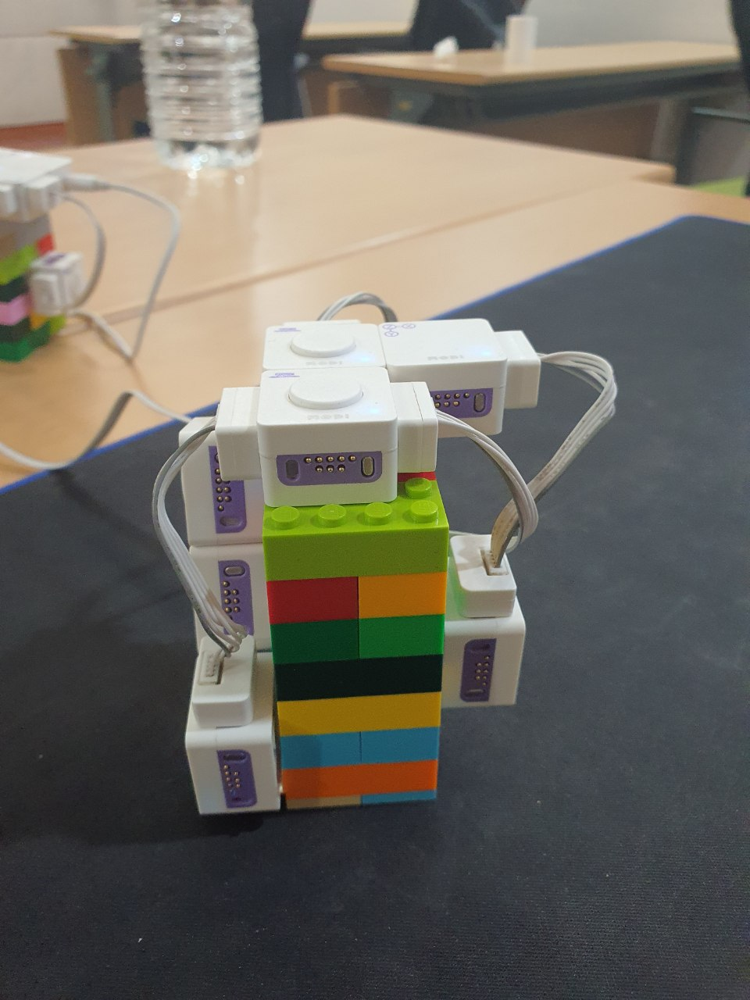
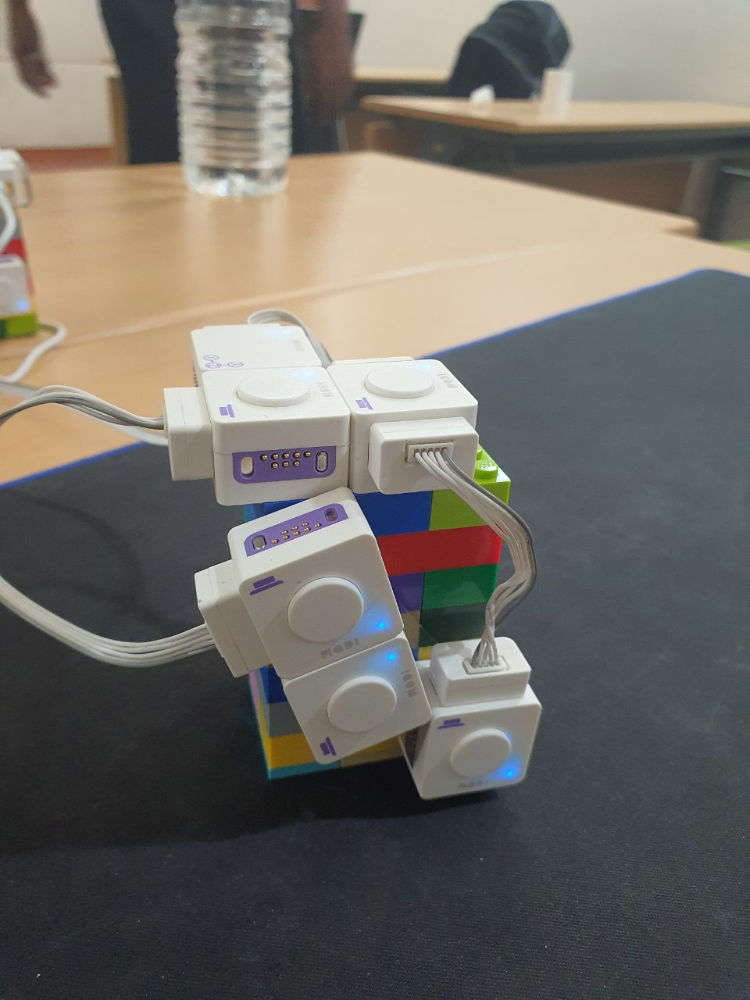
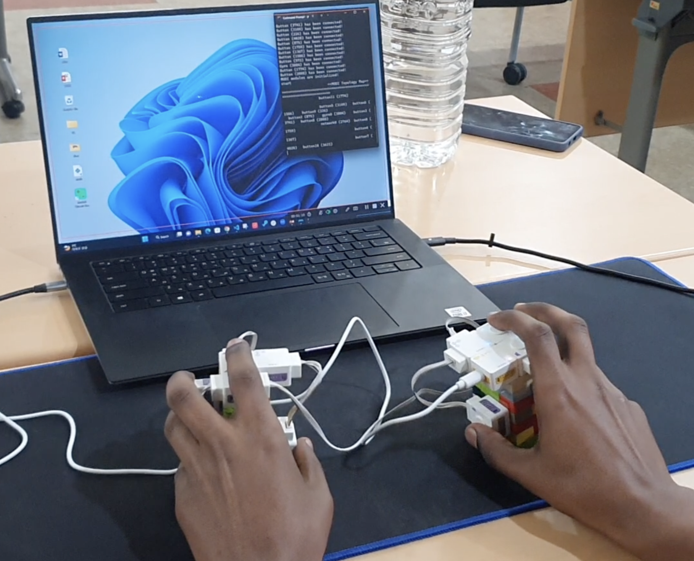

# ModiCharachorder

The hardware components we used to create the modicorder include 12 buttons, connecting wires, 2 gyroscopes, Lego blocks and a network module from the MODI kit. For the software component, we mapped the input sensors from the MODI kit to keyboard and mouse inputs that can be received in any part of the OS.

We added an NLP model that can assist in autocompletion. The NLP model is made using an RNN from the tensorflow library. It consist of three layers. The first layer is the the input layer - A trainable lookup table that will map each character-ID to a vector with predefined dimensions. The next layer is the Keras GRU layer, which is just a type of RNN. The last layer of the model is The output layer, it outputs one logit for each character in the vocabulary. These are the log-likelihood of each character according to the model. 

Once the layers of the model were built, we trained the model on a custom dataset from https://assets.datacamp.com/production/repositories/3937/datasets/213ca262bf6af12428d42842848464565f3d5504/sherlock.txt. This dataset consists of eleven chapter from the famous The Adventures of Sherlock Holmes novel by Sir Arthur Conan Doyle, that is a total of over 6 million characters. 

We trained the model on the google Colab workspace and downloaded the trained weights. These weights were then used to initilize the model on our local machine. The model receives inputs from a keyboard event-listener and outputs the most likely word that can be formed with that input. These runs together with the modichorder program allowing as to autocomplete words by just pressing the tab key on our modichorder.

  

